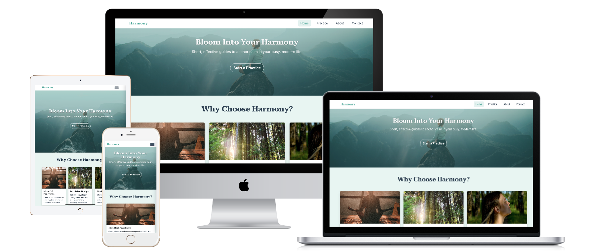
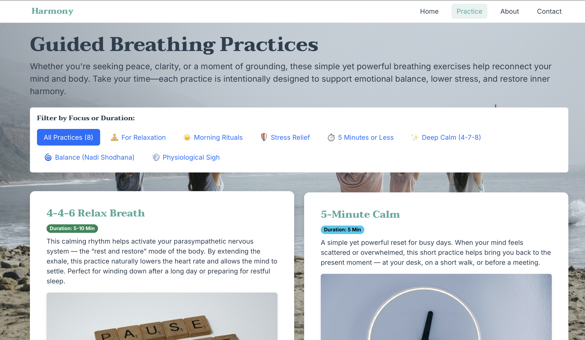

# 🧘 Harmony — A Responsive Guide to Mental Well-being & Breathing

Click **[here to explore the live website](https://ayinuer.github.io/harmony-meditation-site/harmony-meditation-site/index.html)**.

**Project Description:**  
Harmony is a responsive, soothing website designed to offer short, accessible breathing practices that help users anchor calm and reduce daily stress. It follows a mobile-first philosophy, offering a clean, elegant interface with strong UX and modern design principles.

---

## 📋 Table of Contents

* [**🎯 Project Goals & Vision**](#-project-goals--vision)
* [**🖼️ Visual Showcase & Technical Implementation**](#%EF%B8%8F-visual-showcase--technical-implementation)
    * [1. Responsive Adaptability](#1-responsive-adaptability)
    * [2. Key Feature: Practice Filtering](#2-key-feature-practice-filtering)
* [**💻 Tech Stack & Design System**](#-tech-stack--design-system)
* [**✅ User Stories & Features**](#-user-stories--features)
* [**🛠️ Setup & Local Run**](#%EF%B8%8F-setup--local-run)
* [**🐛 Known Issues & Future Plans**](#-known-issues--future-plans)

---

## 🎯 Project Goals & Vision

| Category | Detailed Description |
| :--- | :--- |
| **Core Mission** | To demystify mindfulness by offering short, science-backed breathing practices, eliminating jargon to facilitate the building of daily micro-habits. |
| **Target Audience** | Stressed professionals and students (ages 20–45), prioritizing beginners seeking simple, immediate stress-reduction tools. |
| **User Goals** | 1) Initiate a practice in under 5 minutes. 2) Easily grasp breathwork instructions. 3) Consistently integrate the tool into their daily routine. |

---

## 🖼️ Visual Showcase & Technical Implementation

This section details the critical design and development work behind the site's most impactful visuals.

### 1. Responsive Adaptability

This visual demonstrates the structural integrity of the site across three major breakpoints (desktop, tablet, and mobile).

![Harmony Responsive Devices Mockup]

**Implementation Details:**
* **Mobile-First Development:** The entire site architecture was prioritized for narrow viewports, minimizing reflow and load times for mobile users.
* **Bootstrap Grid System:** **Bootstrap 5.3.3** was implemented for its robust, consistent grid, ensuring elements like the navigation and footer maintain alignment regardless of screen size.
* **Custom Navigation:** The mobile hamburger menu was engineered using a lightweight **pure-CSS checkbox toggle method**, avoiding JavaScript dependencies for faster, more reliable performance.

### 2. Key Feature: Practice Filtering

A screenshot showing the 'Practice' page, highlighting the filter controls and interactive practice cards.

**Implementation Details:**
* **Interactive Filtering:** Practices are categorized using filter pills (e.g., "Calm," "Energy"). This functionality utilizes pure CSS and attribute selectors (or lightweight JavaScript if used) to control the visibility of cards, offering a smooth, instant filtering experience.
* **UX Micro-Animation:** A subtle **`transform: translateY(-3px)`** property was applied via CSS to the practice cards on hover, providing clear, tactile visual feedback to the user before they commit to clicking a card.

---

## 💻 Tech Stack & Design System

### Tech Stack

- **HTML5** — semantic structure for `index.html`, `practice.html`, `about.html`, `contact.html`.
- **CSS3** — modular architecture via `/css/styles.css`.
- **Bootstrap 5.3.3** — responsive grid, layout utilities, and components.
- **Typography:** Taviraj & Inter.
- **Icons:** Font Awesome 6.5.1.

### W3C Validation Status
The project's primary stylesheet has been verified to adhere to web standards.

### Color Palette (CSS Variables)

| Variable Name | Color Value | Usage |
|---------------|-------------|--------|
| `--primary` | `#4ca89a` | Buttons, links, primary highlights |
| `--soft-bg` | `#e9f5f2` | Background and soft UI sections |
| `--text-dark` | `#2C3E50` | Body text & headings |
| `--card-bg` | `#ffffff` | Cards and containers |
| `--muted` | `#607D8B` | Secondary text |

---
## 📱 Responsive Design and UX Details

### 1. Layout and Structure

- Mobile-first approach.
- Bootstrap grid with consistent `g-4` spacing.
- Custom hamburger navigation using the checkbox toggle method for lightweight performance.

### 2. Page-Specific UX & Styling

| Page | UX Feature | CSS Detail |
|------|------------|------------|
| **Home** | Gradient overlay for readability | `linear-gradient` over hero image |
| **Practice** | Filter pills (categories) | Hover lift via `transform: translateY(-3px)` |
| **About** | Reordered content on mobile | Bootstrap `order-md-*` |
| **Contact** | Icon-enhanced form inputs | Font Awesome + Bootstrap validation |

### 3. Image Path Strategy
- CSS uses: `url('../assets/...')`
- HTML uses: `src="assets/..."`
- Consistent relative paths ensure GitHub Pages compatibility.

---

## ✅ User Stories & Features

| User Story | Acceptance Criteria |
| :--- | :--- |
| **As a busy user, I want to view value immediately** | A clear hero headline and Call-to-Action (CTA) are positioned high on the Home page, visible upon initial page load. |
| **As a beginner, I need to know the commitment** | Duration badges are visible on all practice cards, allowing quick decision-making. |
| **As an explorer, I want to quickly find relevant practices** | Clicking filter pills instantly updates the visible practice cards, filtering the library without requiring a page reload. |
| **As a new user, I need to learn instructions easily** | Detailed, step-by-step instructions are hidden and revealed via a button click, promoting focused reading and reducing initial cognitive load. |

---

## 🛠️ Setup & Local Run

To clone and run the project locally, execute the following commands in your terminal:

1.  Clone the repository: `git clone https://github.com/Ayinuer/harmony-meditation-site.git`
2.  Navigate to the directory: `cd harmony-meditation-site`
3.  Open `index.html` in your preferred web browser.

---

## 🐛 Known Issues & Future Plans

### Current Issues
* The current pure CSS filtering mechanism has limited scalability and would need replacement with JavaScript for a massive library.
* A minor mobile viewport scroll shift is observed on some browsers when the custom navigation menu is toggled.

### Future Enhancements
* Implement user streak tracking using **LocalStorage** to encourage daily use.
* Integrate optional ambient audio into practice sessions for enhanced immersion.
* Develop user account functionality to allow saving and tracking favorite practices.

---
**Creator:** Ayinuer Aihaiti | **License:** © 2025 Harmony — Mental Well-being & Breathing Guide
