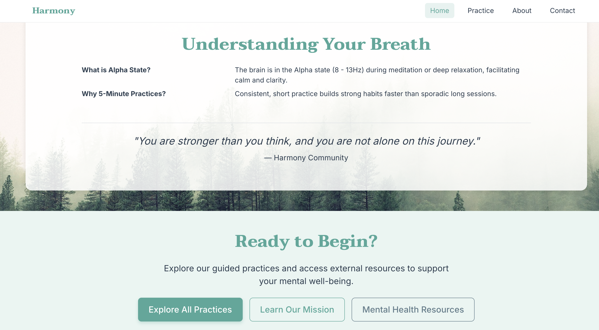
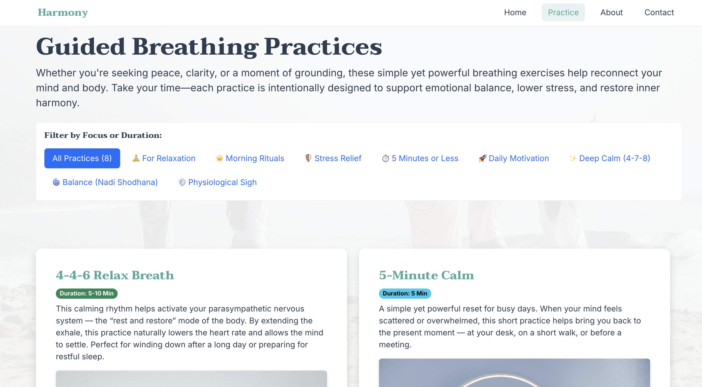
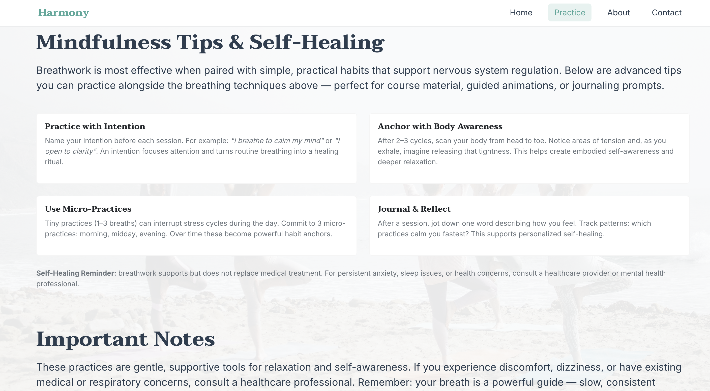
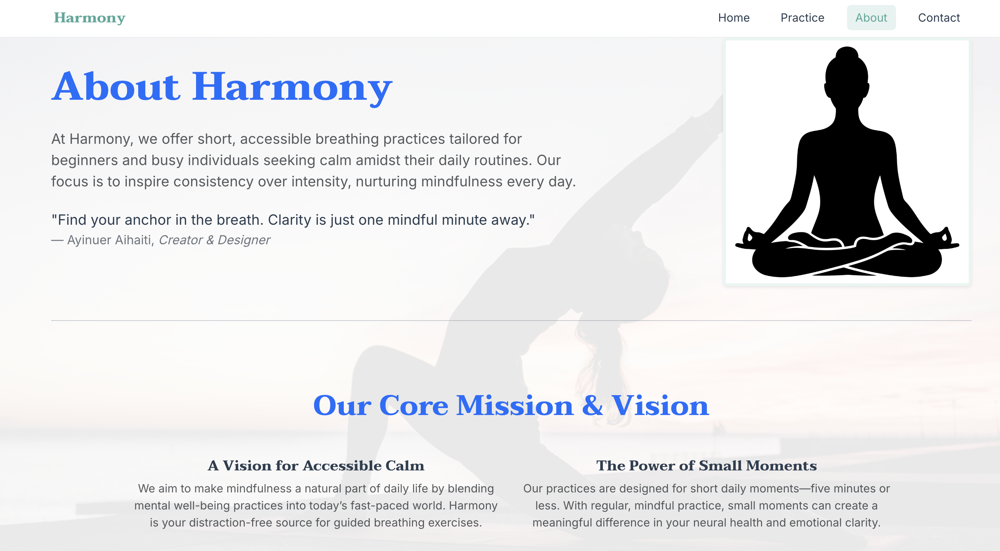
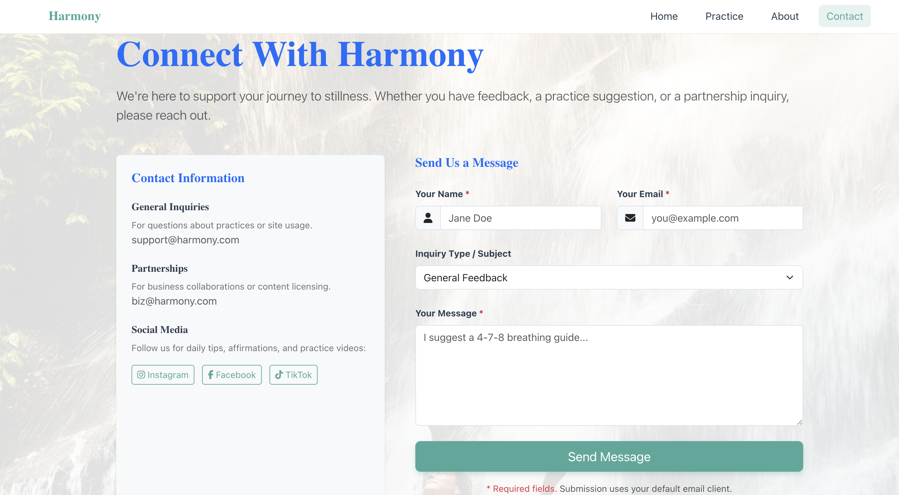
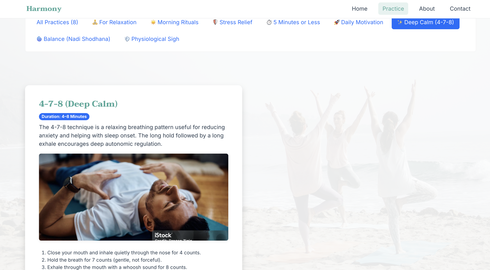
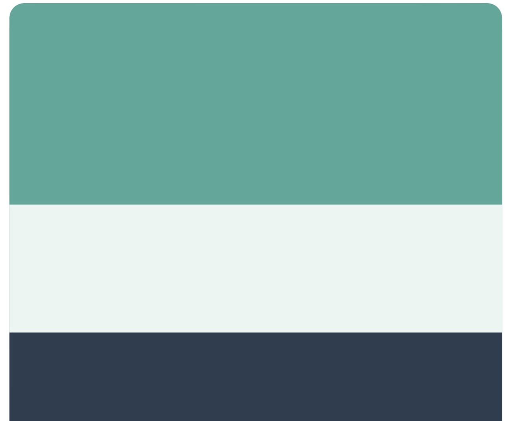

# 🧘 Harmony — A Responsive Guide to Mental Well-being & Breathing

[](https://ayinuer.github.io/harmony-meditation-site/harmony-meditation-site/index.html)
[](https://github.com/Ayinuer/harmony-meditation-site)

👉 **[Explore the live website](https://ayinuer.github.io/harmony-meditation-site/harmony-meditation-site/index.html)**

---

## 📌 Project Description

**Harmony** is a responsive, soothing website designed to offer short, accessible breathing practices that help users anchor calm and reduce daily stress.  
It follows a **mobile-first philosophy**, offering a clean, elegant interface with strong UX and modern design principles.

---

## 📋 Table of Contents

- [🎯 Project Goals & Vision](#-project-goals--vision)
- [🖼️ Visual & Technical Showcase](#-visual--technical-showcase)
  - [1. Responsive Adaptability](#1-responsive-adaptability)
  - [2. Full Site View](#2-full-site-view)
  - [3. Key Feature: Practice Filtering](#3-key-feature-practice-filtering)
- [💻 Tech Stack & Design System](#-tech-stack--design-system)
  - [Color Palette (CSS Variables)](#color-palette-css-variables)
- [📱 Responsive Design and UX Details](#-responsive-design-and-ux-details)
- [✅ User Stories & Features](#-user-stories--features)
- [🛠️ Setup & Local Run](#-setup--local-run)
- [🐛 Known Issues & Future Plans](#-known-issues--future-plans)
- [🚀 Deployment, Validation & Credits (LO2–LO4)](#-deployment-validation--credits-lo2lo4)

---

## 🎯 Project Goals & Vision

| Category | Description |
|-------|-------------|
| **Core Mission** | To demystify mindfulness by offering short, science-backed breathing practices and eliminating jargon to build daily micro-habits. |
| **Target Audience** | Stressed professionals and students (ages 20–45), especially beginners seeking immediate stress reduction. |
| **User Goals** | Start a practice in under 5 minutes, understand instructions easily, and integrate the tool into daily routines. |

---

## 🖼️ Visual & Technical Showcase

This section presents the key design and development outcomes supported by visual evidence.

---

### 1. Responsive Adaptability

Demonstrates consistent layout behavior across **desktop, tablet, and mobile**.


**Implementation Details:**
- Mobile-first development approach
- Bootstrap 5.3.3 grid system for layout consistency
- Pure-CSS hamburger navigation using the checkbox toggle method

---

### 2. Full Site View

Complete visual overview of all primary pages.

#### 🏠 Home Page (`index.html`)



---

#### 🫁 Practice Page (`practice.html`)



---

#### ℹ️ About Page (`about.html`)


---

#### 📩 Contact Page (`contact.html`)


---

### 3. Key Feature: Practice Filtering



**Implementation Details:**
- Category-based filter pills (e.g. Calm, Energy)
- Pure CSS visibility control (scalable to JavaScript)
- Hover micro-interaction using `transform: translateY(-3px)`

---

## 💻 Tech Stack & Design System

### Tech Stack

- **HTML5** — semantic structure
- **CSS3** — modular stylesheet architecture
- **Bootstrap 5.3.3** — responsive grid and utilities
- **Typography:** Taviraj & Inter
- **Icons:** Font Awesome 6.5.1

---

### Color Palette (CSS Variables)



| Variable | Value | Usage |
|--------|-------|------|
| `--primary` | `#4ca89a` | Buttons & highlights |
| `--soft-bg` | `#e9f5f2` | Background sections |
| `--text-dark` | `#2C3E50` | Main typography |
| `--card-bg` | `#ffffff` | Card components |
| `--muted` | `#607D8B` | Secondary text |

---
---

## ✅ Validation & Performance Evidence (LO2)

This project has been fully validated against W3C standards and audited using Lighthouse.

👉 **[View full Validation & Performance Report](./VALIDATION_EVIDENCE.md)**

The report includes:
- W3C HTML validation results for all pages
- W3C CSS validation results
- Lighthouse performance, accessibility, best practices, and SEO audits
- Desktop and mobile screenshots as evidence
## 📱 Responsive Design and UX Details

### Layout & Structure
- Mobile-first approach
- Bootstrap grid with consistent spacing
- Lightweight CSS-only navigation toggle

### UX Highlights

| Page | Feature | Implementation |
|----|--------|----------------|
| Home | Hero readability | Gradient overlay |
| Practice | Filter interaction | Hover lift animation |
| About | Mobile flow | `order-md-*` |
| Contact | Form clarity | Icons + validation |

---

## ✅ User Stories & Features

| User Story | Outcome |
|---------|--------|
| Immediate value | CTA visible on page load |
| Low commitment | Duration badges on practices |
| Fast discovery | Instant filtering |
| Easy learning | Expandable instructions |

---

## 🛠️ Setup & Local Run

```bash
git clone https://github.com/Ayinuer/harmony-meditation-site.git
cd harmony-meditation-site
open index.html