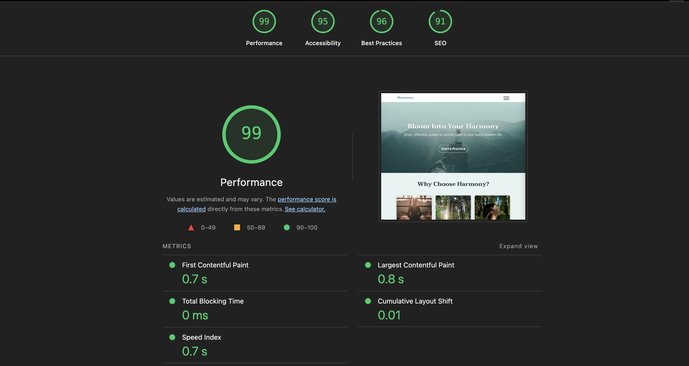
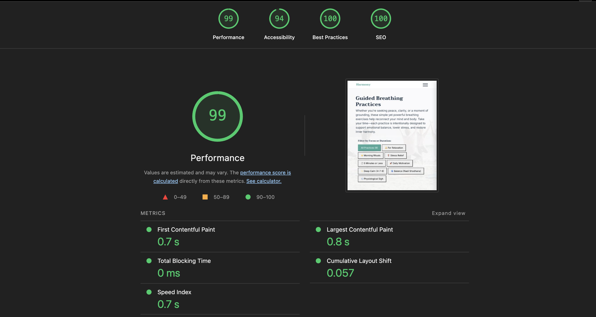
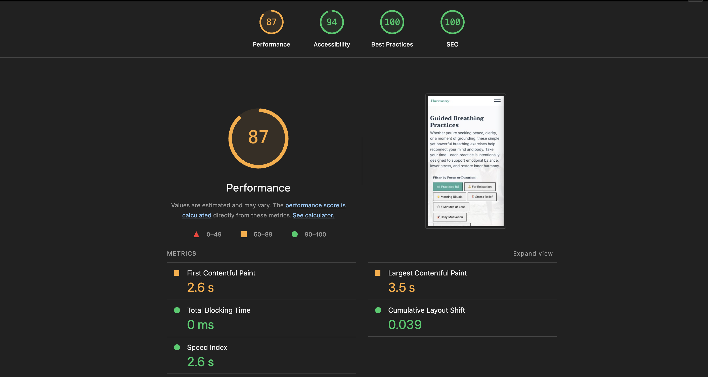
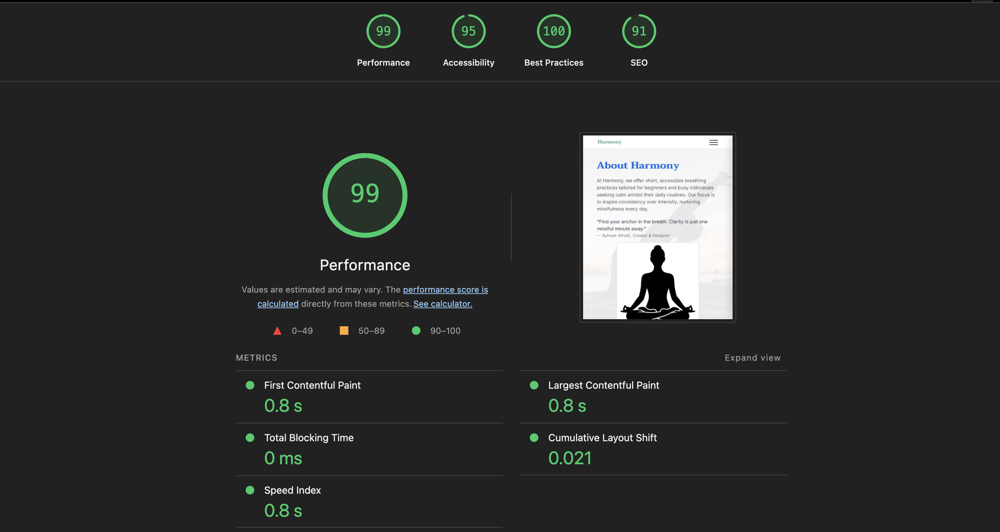
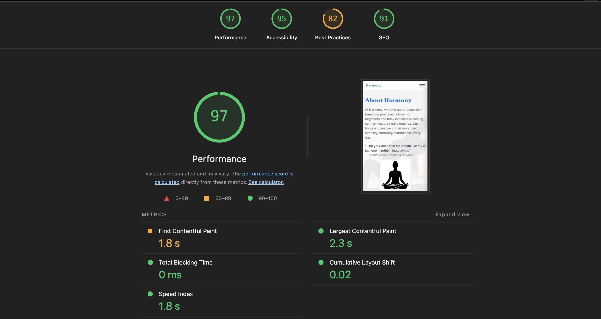
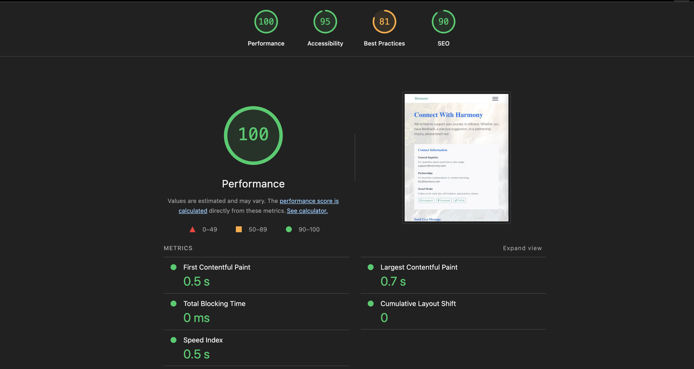
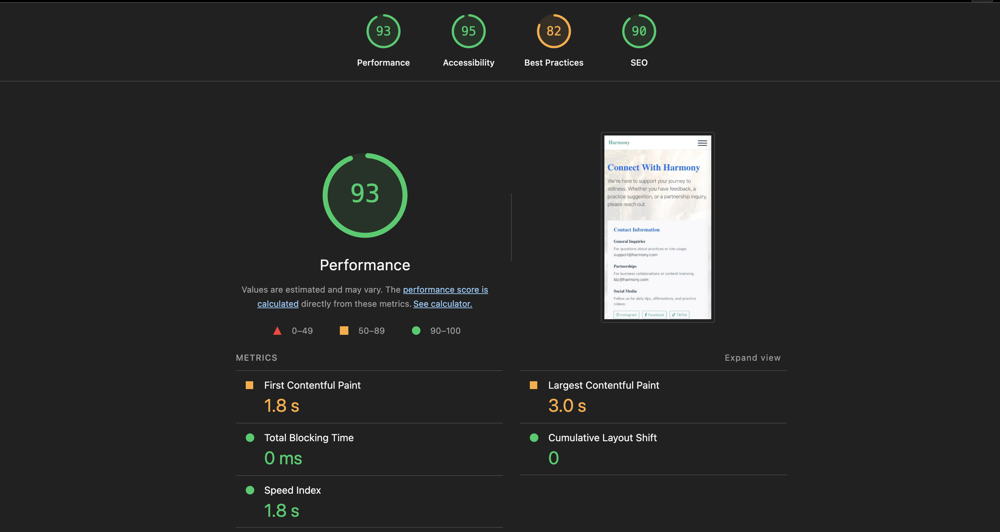

# Performance and Validation Report: FreshCharge+ Website

## 1. CSS Validation

The CSS stylesheet for the FreshCharge+ website was validated using the **W3C CSS Validator (CSS Level 3 + SVG)** via Direct Input.

The stylesheet **passed validation with no CSS errors**, confirming that the code is clean, accessible, and standards-compliant.

Two warnings were displayed, but they do not affect performance or rendering:
* Imported style sheets are not checked in direct-input mode.
* The `clip` property is deprecated.

These warnings are informational only and do not impact the final website.

### CSS Validation Screenshot

Screenshot of W3C CSS Validator Success

## 2. HTML Validation

All HTML pages were validated using the **W3C Markup Validation Service (Validate by Direct Input)**.

All four pages returned **no HTML errors**.

### Home Page HTML Validation

Result: **No errors found**
Validator: W3C Validator (Direct Input)

### Practice Page HTML Validation

Result: **No errors found**
Validator: W3C Validator (Direct Input)

### About Page HTML Validation

Result: **No errors found**
Validator: W3C Validator (Direct Input)

### Contact / FAQs HTML Validation

Result: **No errors found**
Validator: W3C Validator (Direct Input)

---

## 3. Lighthouse Performance Testing
# Validation Evidence Report - Harmony Website

## 1. Lighthouse Performance Audit
The website was audited using Chrome DevTools Lighthouse to ensure high standards for speed, accessibility, and SEO.

### Audit Results (Practice Page)
* **Performance:** 87/100
* **Accessibility:** 94/100
* **Best Practices:** 100/100
* **SEO:** 100/100

### Identified Optimizations
Based on the audit, the following areas are being addressed to move the Performance score to 90+:
* **Eliminate Render-Blocking Resources:** Savings of ~1,780ms identified by optimizing CSS and JS loading.
* **Largest Contentful Paint (LCP):** Currently at 3.5s; being improved by prioritizing hero image loading.
* **Image Optimization:** Converting existing assets to next-gen formats (WebP) to save additional bandwidth.

---

## 2. Page Screenshots & Visual Validation

### Home Page (`index.html`)
* **Description:** Provides an overview of mental well-being and navigation to guided practices.
* **Validation Status:** Responsive design verified for mobile and desktop views.

### Practice Page (`practice.html`)
* **Description:** Features categorized breathing exercises with interactive "Step-by-Step Instructions."
* **Validation Status:** Successfully filtered by "Focus" categories using custom JavaScript.

### About Page (`about.html`)
* **Description:** Details the mission of Harmony and provides mindfulness tips.
* **Validation Status:** All images utilize descriptive `alt` text for high accessibility.

### Contact Page (`contact.html`)
* **Description:** User engagement through a contact form and Frequently Asked Questions.
* **W3C Validation:** **No errors found.** Successfully passed the W3C Markup Validation Service.

## 3. Asset Inventory
The project maintains a structured `/assets` directory with optimized media:
* **Technique Diagrams:** `practice-diagram-box.webp`, `nadi-shodhana-hand-position.webp`.
* **Backgrounds:** `page_background_quote-2.webp`, `about-background.webp`.
* **Illustrations:** `practice-pose-relax.webp`, `practice-scene-calm.webp`.

