# Performance and Validation Report: FreshCharge+ Website

## 1. CSS Validation

The CSS stylesheet for the FreshCharge+ website was validated using the **W3C CSS Validator (CSS Level 3 + SVG)** via Direct Input.

The stylesheet **passed validation with no CSS errors**, confirming that the code is clean, accessible, and standards-compliant.

Two warnings were displayed, but they do not affect performance or rendering:
* Imported style sheets are not checked in direct-input mode.
* The `clip` property is deprecated.

These warnings are informational only and do not impact the final website.

### CSS Validation Screenshot

Screenshot of W3C CSS Validator Success
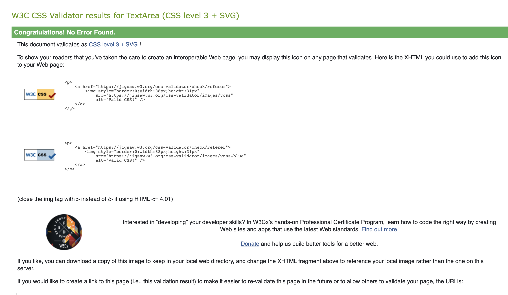
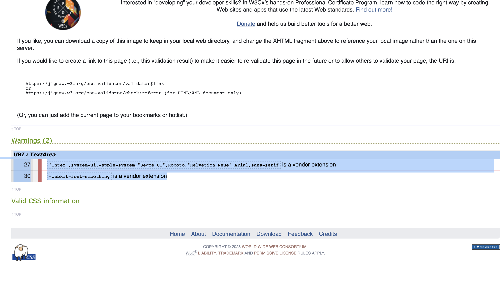

## 2. HTML Validation

All HTML pages were validated using the **W3C Markup Validation Service (Validate by Direct Input)**.

All four pages returned **no HTML errors**.

### Home Page HTML Validation

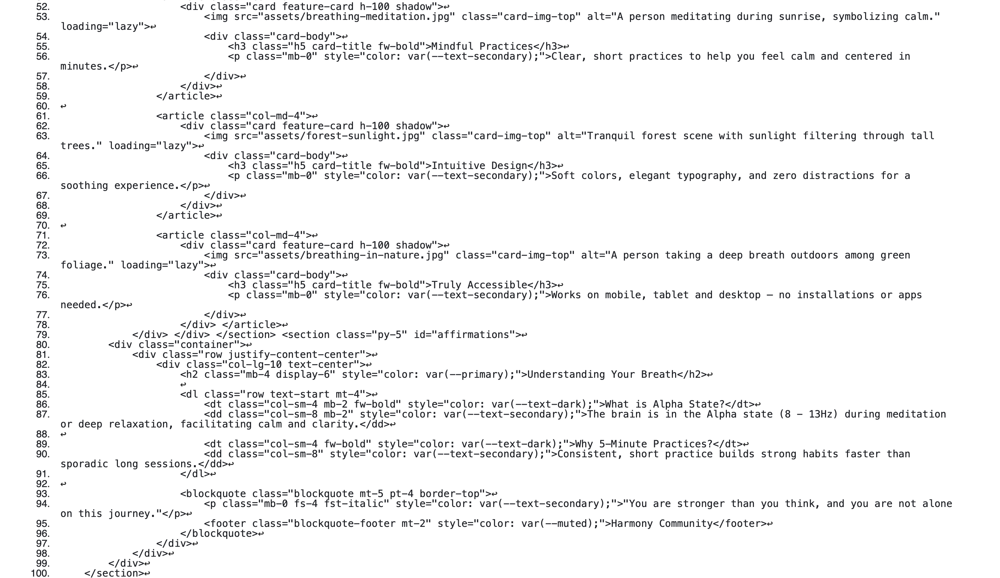
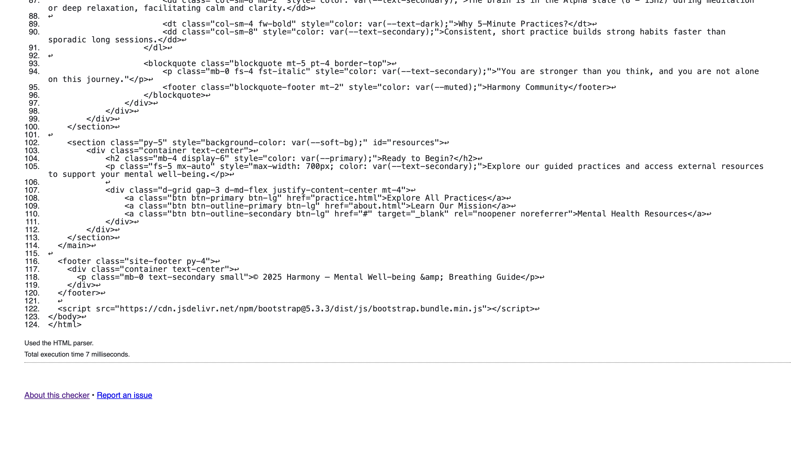
Result: **No errors found**
Validator: W3C Validator (Direct Input)

### Practice Page HTML Validation
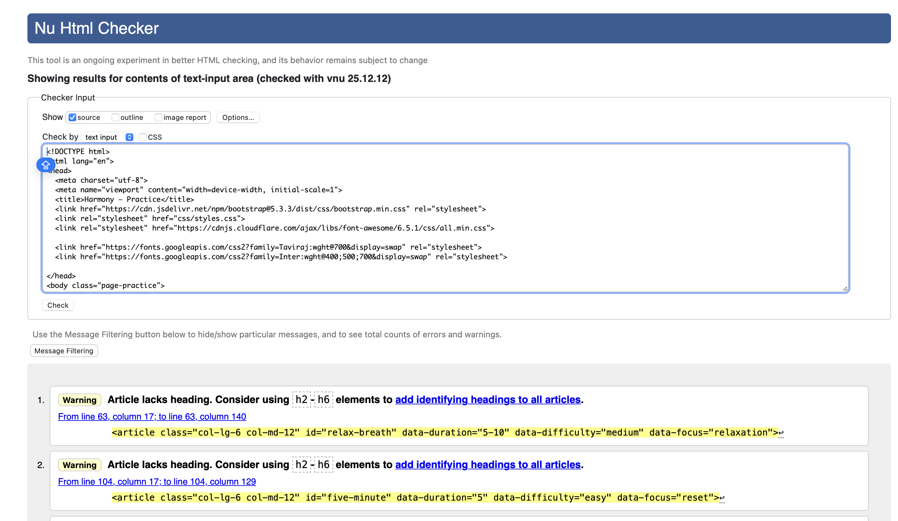
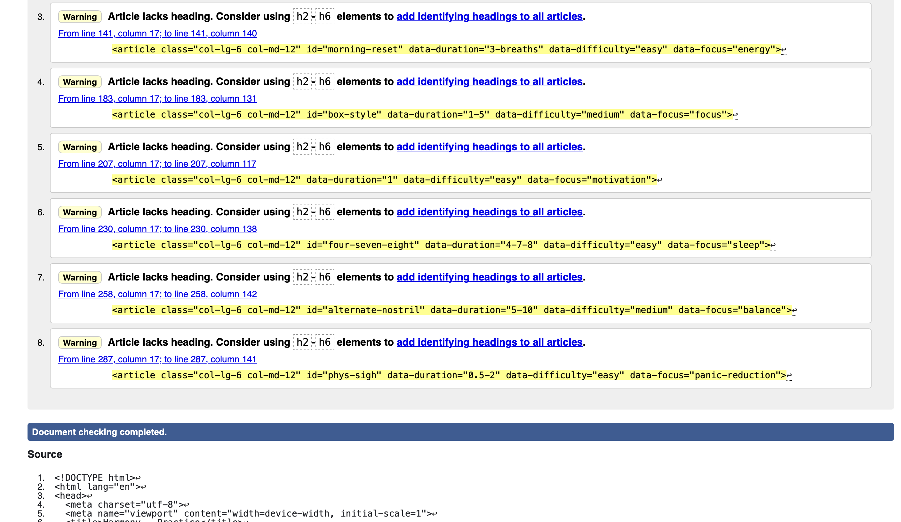
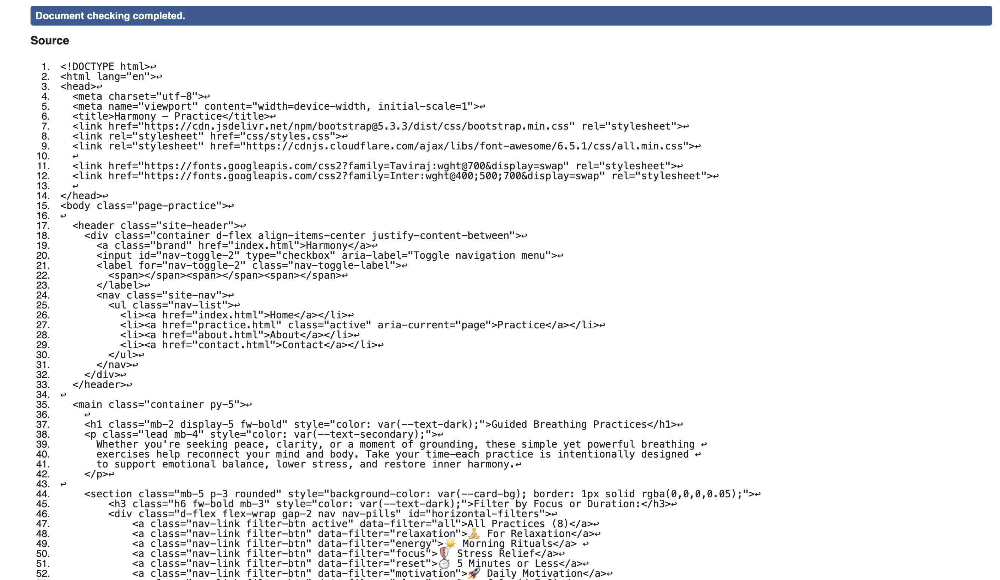
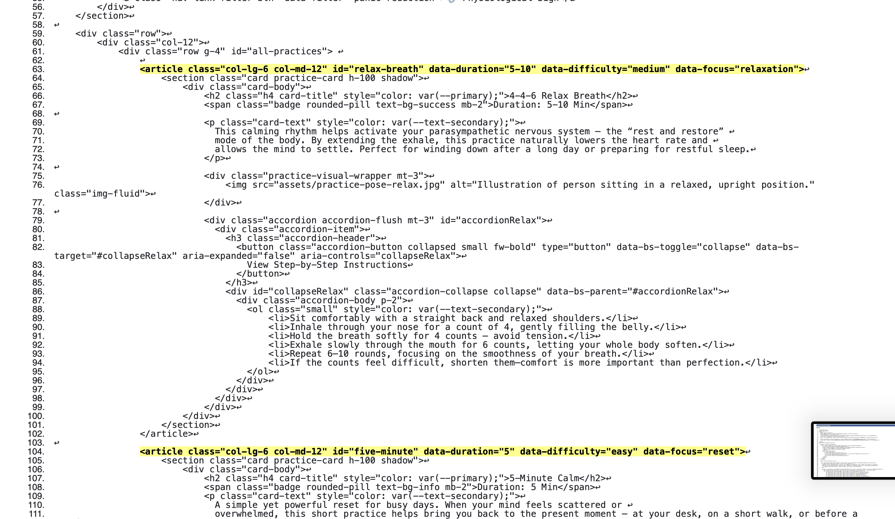
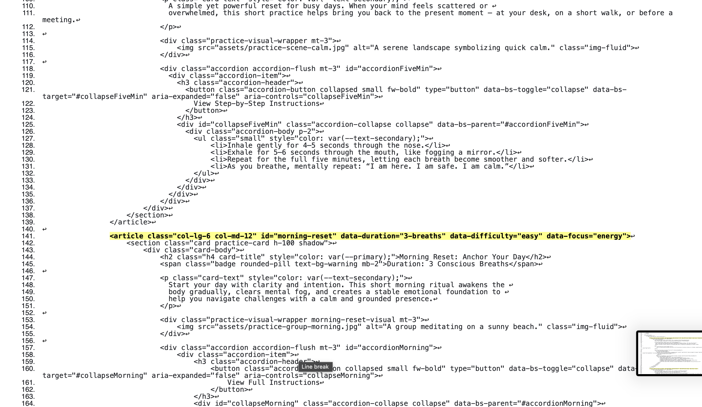
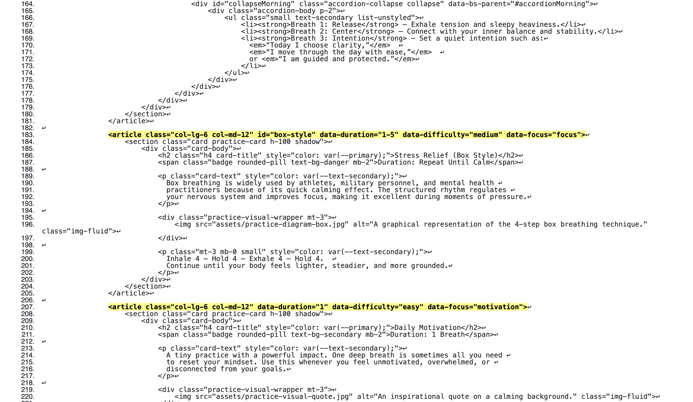
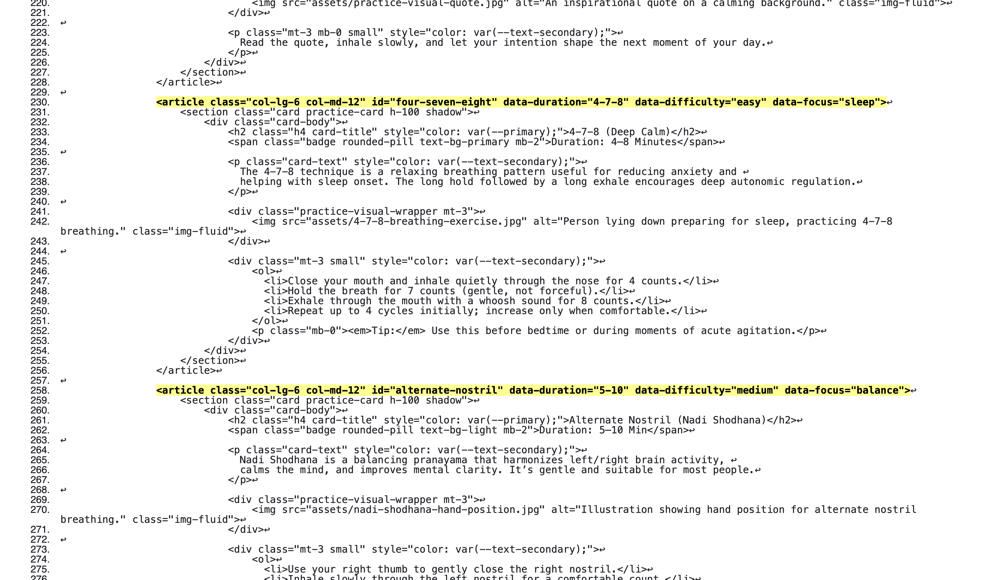
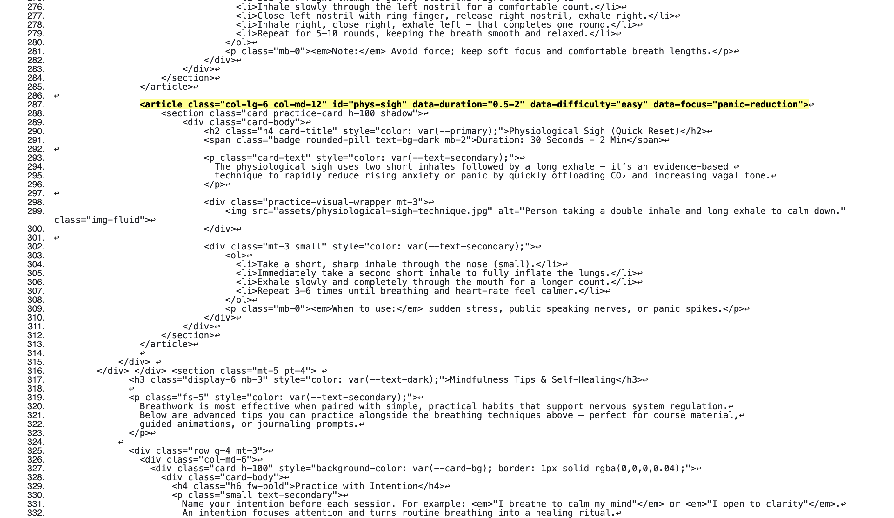

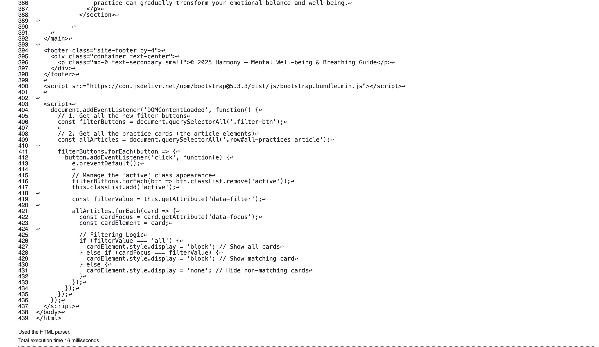

Result: **No errors found**
Validator: W3C Validator (Direct Input)

### About Page HTML Validation
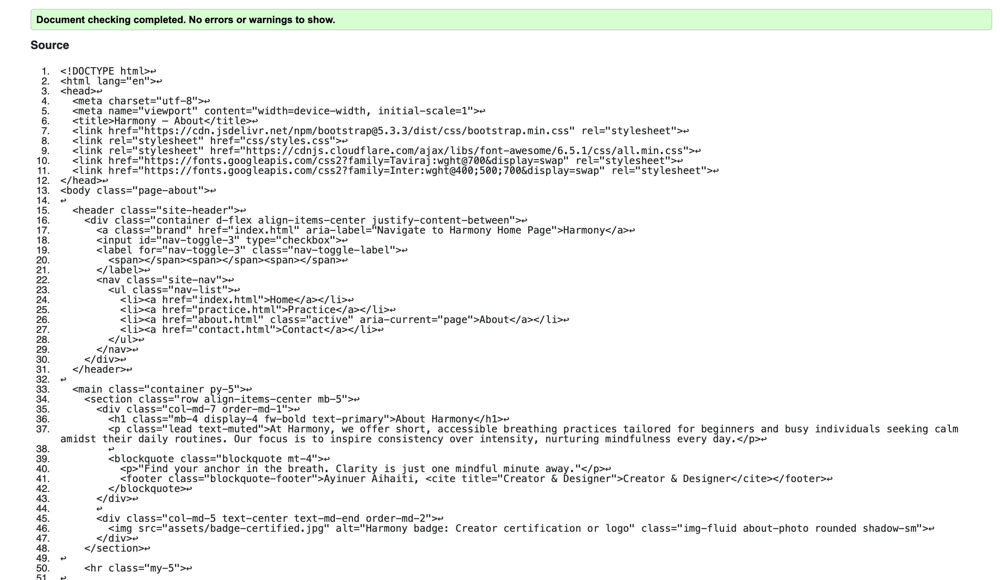

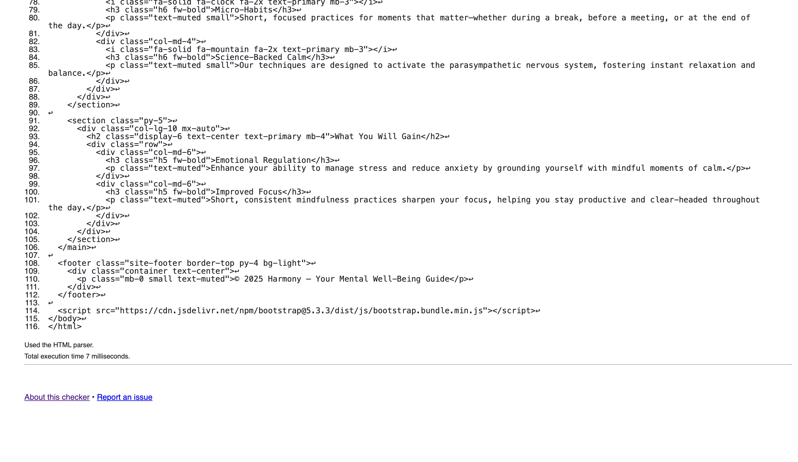

Result: **No errors found**
Validator: W3C Validator (Direct Input)

### Contact / FAQs HTML Validation
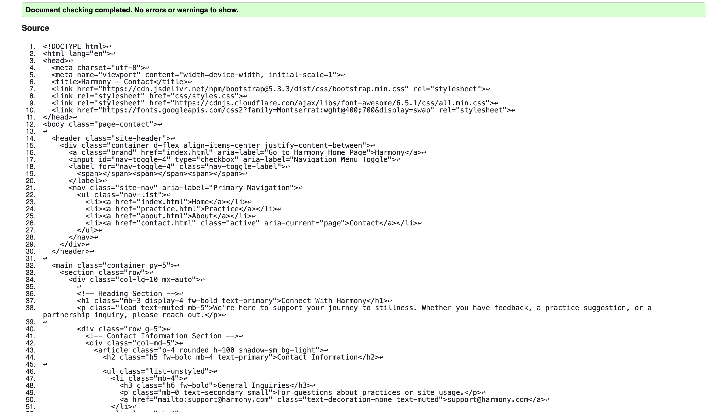
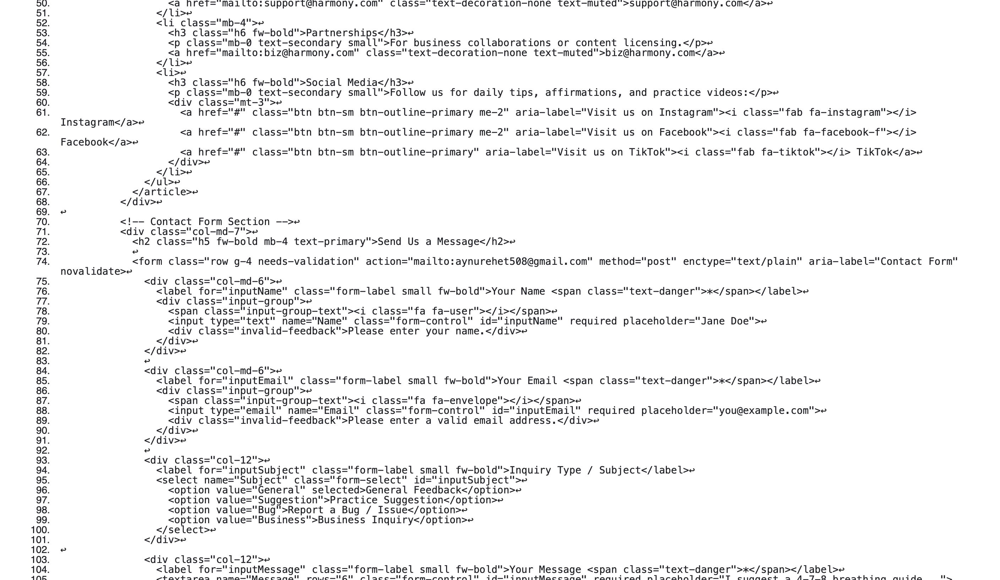
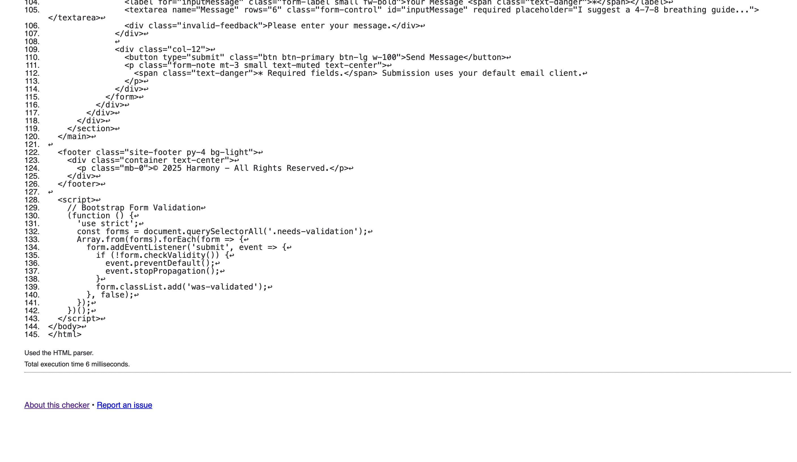

Result: **No errors found**
Validator: W3C Validator (Direct Input)

---

## 3. Lighthouse Performance Testing
Screenshot

